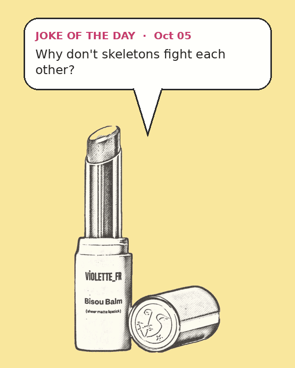

# Product GIF Maker

Turns a product photo into an animated GIF: the product sways side to side
while a speech bubble shows the **joke of the day** or **riddle of the day**.



## How it works
1. **Cut out the product.** The script reads the background colour from the top-left corner and flood-fills from the image corners to remove it. Only background touching the edges is removed, so colours inside the product stay.
2. **Pick today's joke.** `jokes.py` holds the jokes and riddles. The date seeds `random`, so the same day always gives the same pick. `--kind auto` gives jokes on even days and riddles on odd days.
3. **Animate.** For each of 48 frames the product is shifted and tilted along a sine wave. The bubble's tail follows the product. A joke's punchline (or a riddle's answer) appears halfway through the loop.

## Usage
```bash
pip install -r requirements.txt
python product_gif.py products/bisou_balm.png                  # joke or riddle, by date
python product_gif.py products/bisou_balm.png --kind riddle
python product_gif.py products/bisou_balm.png --text "Kiss dry lips goodbye!"
python product_gif.py products/bisou_balm.png --date 2026-12-25 -o xmas.gif
```
Works best with a product on a plain, solid-colour background.
